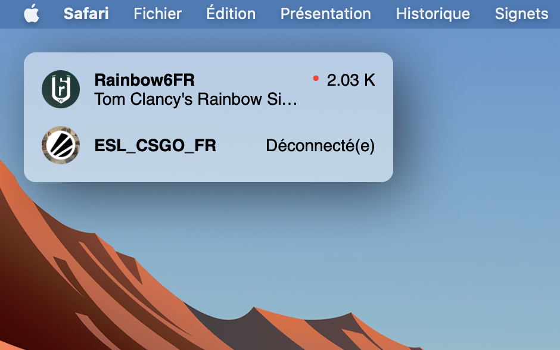

# Twitch channels Übersicht Widgets

<p align="center">
    
</p>

## Get Twitch credentials

- Create a Twitch app in [Twitch console](https://dev.twitch.tv/console) following this [tutorial](https://dev.twitch.tv/docs/api/get-started).
- Get your Client identifier.
- Generate a new Client secret.
- Generate a token using above command.
- Set your Client ID and Token in ```app.py``` file.

```bash
bash getToken.sh --id "<Your Client Id>" --secret "<Your Client Secret>"
```

## Install python modules requirements

```bash
pip3 install -r requirements.txt
```

## How to change the channels list

Add the different channels names to the ```channels.txt``` file.
